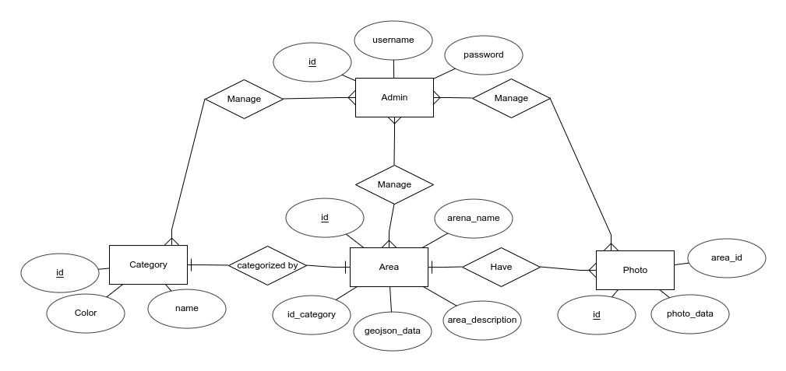

# GIS Codeigniter
[](https://opensource.org/licenses/MIT)
[](http://makeapullrequest.com)
[](http://hits.dwyl.com/luqmansen/gis-codeigniter)
[](https://twitter.com/luqmansen_)

Geographic Information System using Code Igniter

## Demo 
https://gis.luqmansen.me/home

## Requirements
- docker
- docker-compose

if you're not using provided docker configuration
- php7.2 (Other version not tested)
- mysql 8.0.19 (Other version not tested)

## Running
#### With docker
```
docker-commpose up
```
Current directory will be mounted on docker volume 
and app will running on localhost:80

## Others
#### ERD


## License
[MIT License](license.md)
